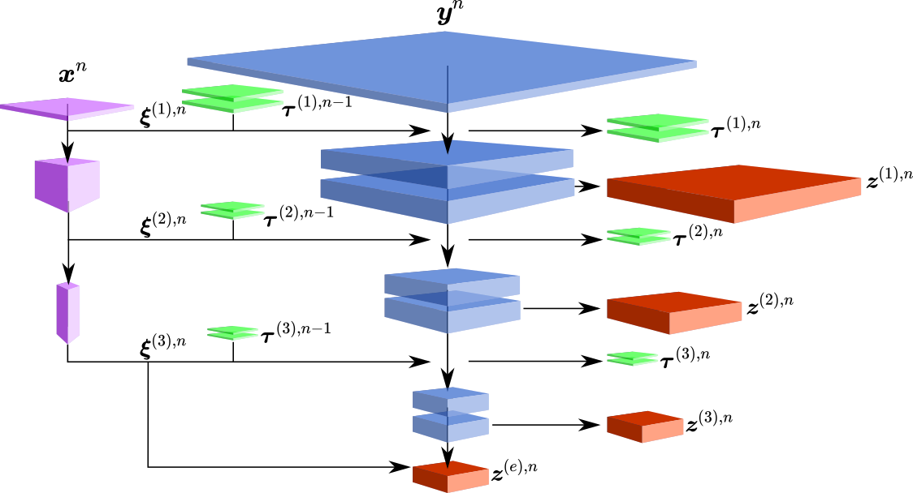

.. _getting_started:

Getting Started
===============

   TM-Glow model. This model is comprised of a low-fidelity encoder that conditions a generative flow model to produce samples of high-fidelity field snapshots. LSTM affine blocks are introduced to pass information between time-steps using recurrent connections.

1. Clone the repository
-----------------------
Start with cloning the repository to your local machine using:
 ``git clone git@github.com:zabaras/deep-turbulence.git``

.. _download-data:

2. Downloading Data
-------------------
To download both the training and testing data for both of the numerical examples, visit the following Zenodo repository.
`https://doi.org/10.5281/zenodo.4311698 <https://doi.org/10.5281/zenodo.4311698>`_

The data-sets are compressed tarfiles, note that pre-trained models are also included in this repository.
Extract the data using ``tar –xvzf data-set-name.tar.gz``, and move the training and testing data the desired directory.

The default directories of the data in the config are:

- ``/deep-turbulence/step-training/``
- ``/deep-turbulence/step-testing/``
- ``/deep-turbulence/cylinder-training/``
- ``/deep-turbulence/cylinder-testing/``

But custom paths can be easily adjusted through run parameters or explicitly in :class:`args`.

3. Set-up Conda Python Environment
----------------------------------
For your convenience, a requirements.txt file is provided in ``/tmglow/`` which will allow the easy creation of a conda environment that contains
the required packages used. 

``conda create --name <env_name> --file requirements.txt``

4. Start Training
-----------------
To start training the model simply run :doc:`tmglow/main`. 
There are many customizable parameters you can change in :doc:`tmglow/args` which can be view with ``python main.py --help``. 
Both numerical examples have pre-coded
configurations.

For example:

- Train the model for the backward-step example: ``python main.py --exp-type backward-step``
- Train the model for the backward-step example: ``python main.py --exp-type cylinder-array``
- Use a custom training directory: ``python main.py --training_data_dir <custom directory>``
- Change number of epochs: ``python main.py --epochs <# epochs>``
- Start a model from a particular epoch: ``python main.py --epoch_start <epoch>``

.. warning::
    Memory constraints on the GPU will likely be of concern. Parallel training is supported but only on a single 
    node (not multiple CPU) which can be controlled through ``--n_gpu`` and ``--parallel`` options. 
    Support is not provided for debugging GPU memory or parallel issues.

5. Running Pre-trained Models
-----------------------------
Alternatively, you can skip the training and simply run a pre-trained models.
Two programs for running pre-trained models can be found in the ``examples`` folder.
The pre-trained models for each numerical example are found on the `Zenodo data repository <https://doi.org/10.5281/zenodo.4311698>`_.
Once downloaded, these files should be simply placed in the examples directory.

.. warning::
    Do **not** unzip the workspace files, they should be just copied as is. TM-Glow will unzip them for you and read necessary data.

The general work flow of running a model for prediction is:

1. Load model from the workspace zip file.
2. Load testing data from compressed numpy array files.
3. Run model and generate time-series samples.
4. Post process and plot.

.. note::
    These programs require you download the *testing* data from the Zenodo data repository. The default location this data should be unzipped to is discussed in step :ref:`download-data`.
    However, one can easily customize the data location in each script.

